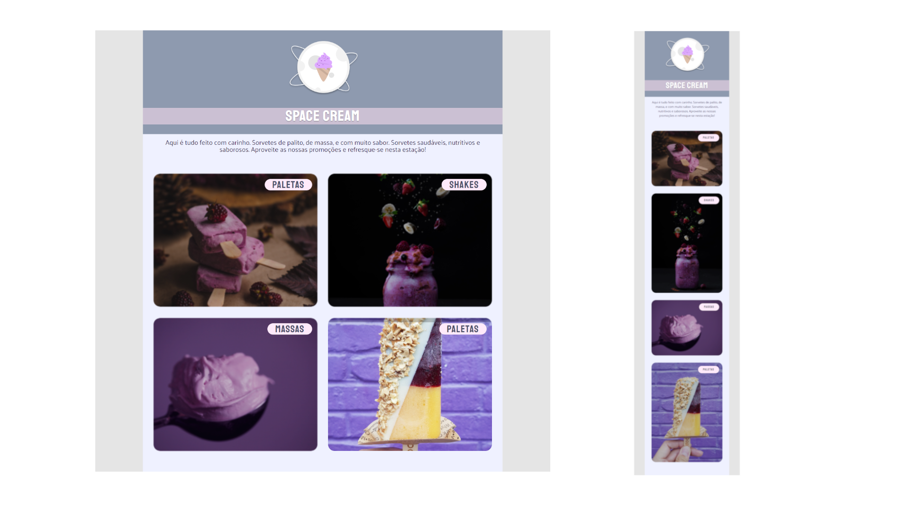

  

## 🖥️ Projeto
Nesse desafio foi desenvolvido uma página de uma sorveteria Space cream onde pudemos aplicar os conceitos de css como grid, filter, clamp, transform, transition, animation, @keyframes, @media queries, espaçamentos e fontes responsivas além de começar pela versão mobile (mobile first) e como o layout vai se comportando em diferentes telas.

## 🚀 Tecnologias
Foi desenvolvido esse projeto no programa Explorer da Rocketseat no stage 02.

- HTML
- CSS
- GIT
- GITHUB
- FIGMA

## 👁 View
Aqui você pode visualizar o layout do projeto
<a 
  href="https://www.figma.com/file/NYwGPQu2egVmisL9IIDhb7/Stage-03---Mobile-First-(Copy)?type=design&node-id=0-1&t=tSX43rValf4tpWvQ-0" target="_blank">clique aqui</a>
